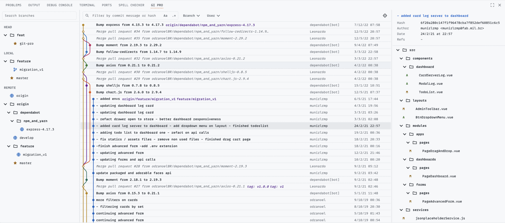
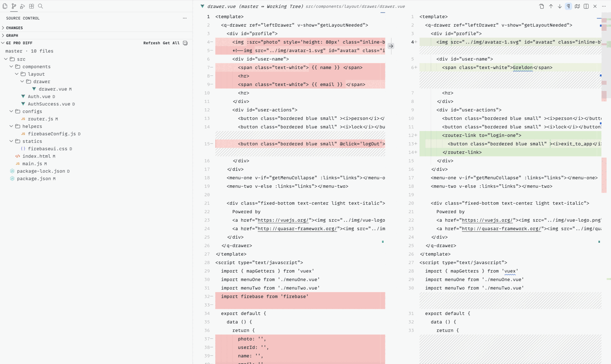
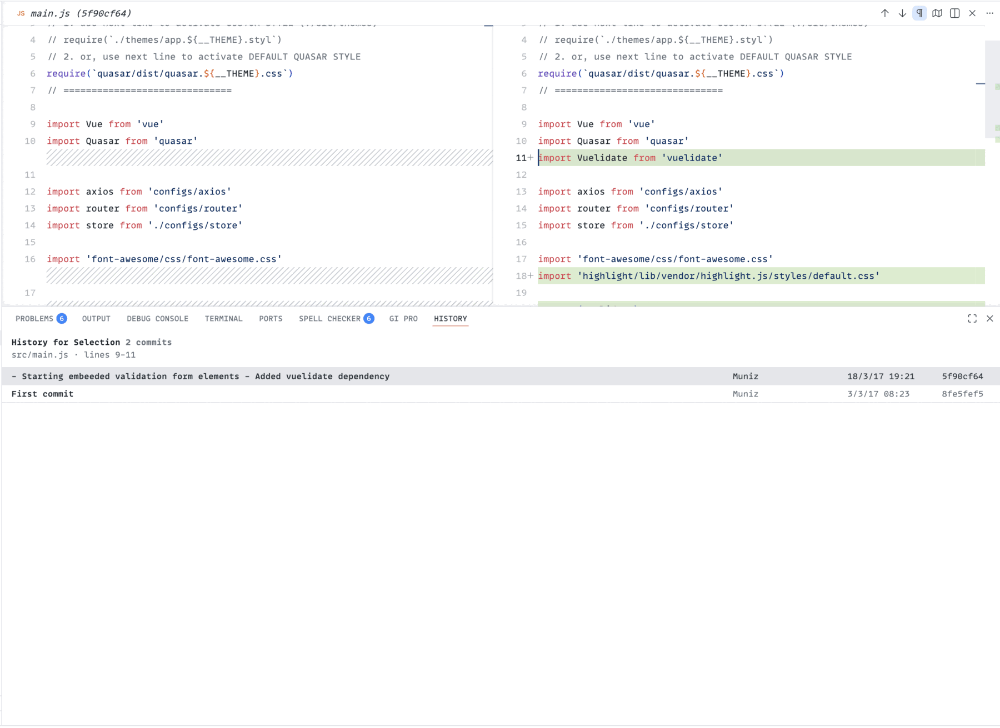
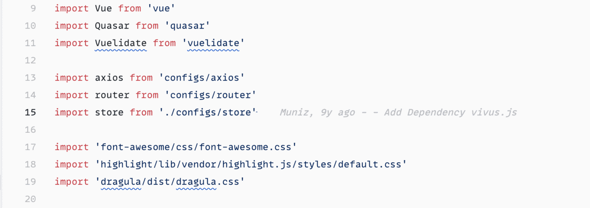

# GI Pro

GI Pro brings fast Git workflows into VS Code: a visual log view, file history, selection history, inline blame, and common Git actions from the Command Palette and editor context menu.

## Features

- Visual Git Log view with branch tree, commit graph, commit search, changed-file tree, and patch preview.
- File History from the editor context menu.
- History for Selection to trace commits that touched selected lines.
- Inline blame on the active cursor line.
- Smart Commit with staged and unstaged change handling.
- Quick Git actions for fetch, pull with rebase, push, force push with lease, stash, branch checkout, interactive rebase, and cherry-pick.
- Branch diff view in the Source Control sidebar.

## Preview

### Visual Git Log

Browse branches, search commits, inspect the graph, and review changed files from one panel.



### Working Tree Diff

Compare a branch with your working tree and get individual files or all changes from the selected branch.



### History for Selection

Select lines in a tracked file and see the commits that touched that exact range.



### Inline Blame

See author and commit information for the active line without leaving the editor.



## Requirements

- VS Code 1.92.0 or newer.
- Git installed and available on your `PATH`.
- An open workspace folder that is inside a Git repository.

## Quick Start

1. Open a Git repository in VS Code.
2. Open the Command Palette with `Cmd+Shift+P` on macOS or `Ctrl+Shift+P` on Windows/Linux.
3. Run `GI Pro: Open Log View`.
4. Click a commit to inspect details and changed files.
5. Click a changed file to preview its patch.

## Common Workflows

### Open the Git Log

Run `GI Pro: Open Log View` from the Command Palette.

In the Log view:

- Use the branch tree to select a branch.
- Use the commit search box to filter commits by message or hash.
- Click a commit to load metadata, changed files, and patch content.
- Double-click a branch to check it out.
- Right-click a commit for actions such as copy hash, cherry-pick, create branch, create tag, revert, and reset.

### View File History

Open a tracked file, right-click in the editor, then choose `GI Pro: Show File History`.

GI Pro opens the History panel with commits that changed the file. Click a row to open a diff for that commit.

### View History for Selected Lines

Select one or more lines in a tracked file, right-click the editor, then choose `GI Pro: Show History for Selection`.

This uses Git line history to show commits that touched the selected range.

### Compare a File with HEAD

Open a tracked file, right-click in the editor, then choose `GI Pro: Compare File with HEAD`.

### Use Inline Blame

Move the cursor inside a tracked file. GI Pro shows blame information for the active line when inline blame is enabled.

### Run Quick Git Actions

Use the Command Palette and search for `GI Pro`.

Available actions include:

- `GI Pro: Smart Commit`
- `GI Pro: Fetch All`
- `GI Pro: Pull with Rebase`
- `GI Pro: Push`
- `GI Pro: Force Push with Lease`
- `GI Pro: Stash Changes`
- `GI Pro: Pop Stash`
- `GI Pro: Checkout Branch`
- `GI Pro: Interactive Rebase`
- `GI Pro: Cherry-pick Commit`
- `GI Pro: Abort`

## Settings

GI Pro contributes these settings:

- `giPro.terminalName`: terminal name used to run Git commands. Default: `GI Pro`.
- `giPro.smartCommitPushAfterCommit`: ask whether to push after a smart commit. Default: `false`.
- `giPro.inlineBlame.enabled`: show inline Git blame on the active cursor line. Default: `true`.
- `giPro.inlineBlame.delayMs`: delay before refreshing inline blame after cursor movement. Default: `50`.

## Troubleshooting

### Commands do not show repository data

Make sure the current workspace folder is inside a Git repository and Git is installed.

### File History is empty

The file must be tracked by Git. New files that have never been committed do not have file history yet.

### History for Selection fails

Git line history only works for tracked files. Save the file first, then try again.

### Git actions fail

Open the `GI Pro` terminal and check the Git output. Most failures come from repository state, authentication, merge conflicts, or missing remotes.

## Development

```bash
npm install
npm run compile
```

Open this folder in VS Code and press `F5` to launch an Extension Development Host.

To package locally:

```bash
npx vsce package
```
